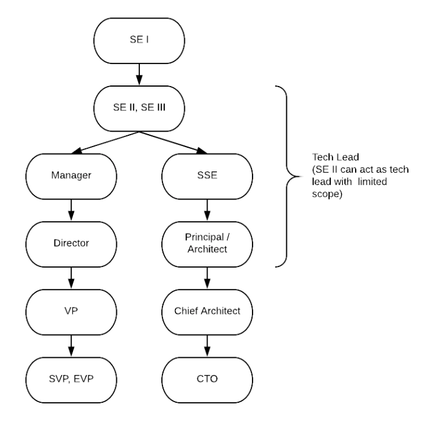

## Growing at Shippo (WIP)

This doc describes how we grow in responsibilities at Shippo.  Its really a guideline of how you'd advance your skills.  This is also tied to advancement at Shippo and growing your role.  While titles somewhat matter, its really your desires, skills and responsibilities that determine your place at the company.

### How we evaluate performance

We do formal evaluations every quarter, with alternating topics of performance evaluations and career development discussions.  We also do continuous and timely feedback during 1x1s and after meetings or discussions.  The general items we'd look at are:

- How are you performing relative to your level and expectations?
- How are your opinions and ideas implemented in meaningful ways?
- How has your work impacted the business?
- How well do you execute on your OKRs?
- Is your team successful?
- How much do you embody our core values and behaviors?

### Levels

In the end, we still need tiers to be fair, so here's rough sketch of our levels

#### Engineering Track

Level | Description
----- | ----------
Software Engineer I | <li>Works on tasks independently, with minimal instructions</li><li>Completes own projects, with light project management help from lead</li><li>Creates software that solves business problems on schedule and with quality</li><li>Tests and maintains own software and any other software as assigned</li><li>Is a team-player, willing and able to assist other team members as responsibilities permit</li><li>Has a strong foundation and continually improve software and systems skills, keeping up-to-date with current best practices</li>
Software Engineer II | <li>SE I responsibilities</li><li>Works on and completes project independently, with minimal instructions, breaking down projects into manageable tasks with minimal supervision from lead</li><li>Researches potential solutions to technical problems, applies solid technical judgement in choosing a solution, and obtains buy-in for chosen solution</li><li>Actively proposes process and procedure improvements that streamline the functioning of the teams</li><li>Manages project progress, dependencies, and deadlines in real-time and actively adjusts and communicates with stakeholders to meet commitments</li>
Software Engineer III | <li>SE II responsibilities</li><li>Designs technical solutions that involves multiple components of the system <li>Manages the completion of a project, planning the roll-out, and supervising the maintenance of the projects.</li><li>Assists with production support and process and procedure enhancements, taking on pager-duty rotation as assigned</li><li>Plays a critical role in helping identify good recruits, sell them on the company, and assist with their onboarding </li><li>Leads in the creation and adoption of conventions, standards, and processes that help the team</li>

#### Technical Leadership Track

Level | Description
----- | -----------
Senior Software Engineer | <li>SE III responsibilities</li><li>Manages implementation of the project across multiple team members</li><li>Implements measurements pre- and post-rollout to manage the software</li><li>Automates processes to ensure solution scales and is maintainable</li><li>Mentors engineers on technical topics, providing constructive feedback</li><li>Acts as liaison to the other functions in providing technical assistance, guidance, and expertise</li>

#### People Leadership Track

### Compensation

The question might come up to "well how does this translate to salaries and raises"?  While its related, its not directly tied, here's how we calculate it is based on these 4 things

* Employee performance
* Business impact
* Relative scarcity of skill
* Internal & External benchmarks

### Resources

Compensation model created by PeopleOps with similarites to Adobe's model from Measure what Matters   
Detailed Job description of an [Engineering Leader](https://docs.google.com/document/d/19goqgF86b6qcs45Mo-JEbw7FpIVKA2Do-3epGWN4FK4/edit)  