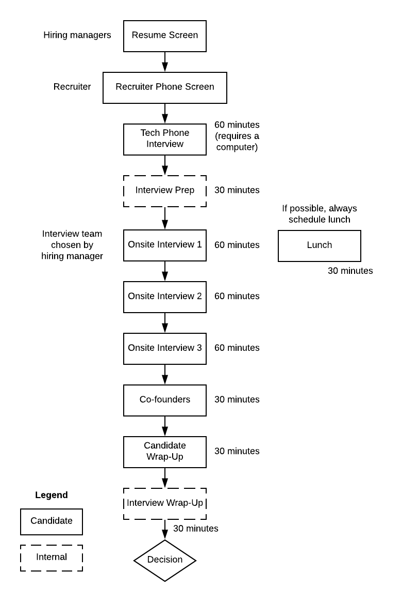

## Hiring @ Shippo (WIP)

At Shippo we look at 3 dimensions for a software engineering candidate

* Core values and behaviors fit
* Technical Ability
* Diversity of Thought

### The Process

We have a pretty straight forward process.  We aim to make it speedy, painless (as possible) while still making sure you and Shippo vet each other appropriately.  Here's a chart describing our process

### Helpful Notes

All of our job openings are listed [here](https://goshippo.com/jobs/).  Look at this often, as we're growing and have some high targets for this year's OKRs)

While we can't reveal the exact questions we'll ask during the on-site technical interviews, here are some general guidelines

__Onsite Interview 1__ - Coding & Code Review    
__Onsite Interview 2__ - System Design    
__Onsite Interview 3__ - Software Design & Architecture    
__Manager Wrap-up & Feedback__ - We want to gather feedback about how the interview went, and give us feedback about the process (what went well, what could be improved).  We'll also provide you any feedback.  We also like to know what you are looking for in the job

*Note, we will look at your background and figure out the right engineers to interview you, and may tailor some questions based on your background.

For Shippos, here is our detailed [Wiki](https://shippo.atlassian.net/wiki/spaces/SW/pages/46530584/Engineering+Recruiting+Process)

## Join us!

